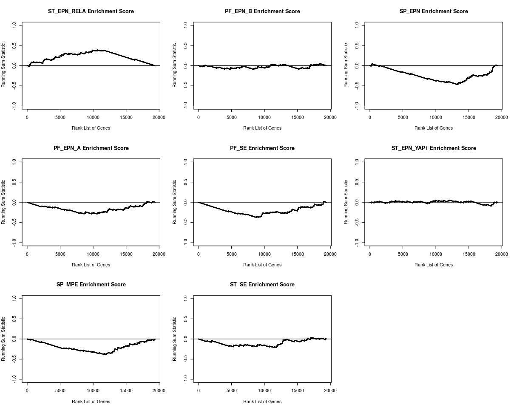
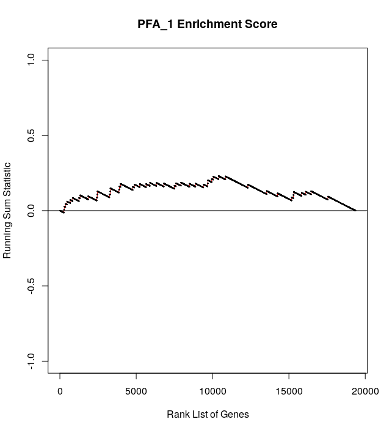

EPNClassifier
================

EPNClassifier assigns ependymal tumors profiled by bulk transcriptomics (RNA-seq or microarrays) into molecular subgroups from [*Pajtler K.W. et al., Cancer Cell 27 (2015)*](https://www.sciencedirect.com/science/article/pii/S153561081500135X?via%3Dihub) and [*Pajtler K.W. et al., Acta Neuropathol 136 (2018)*](https://link.springer.com/article/10.1007/s00401-018-1877-0). It is based on gene set enrichment analysis of pre-determined gene signatures. Significant p-values can be used to classify EPN tumors into their most-likely molecular subgroup. PFA tumors can be further classified into subtypes (PFA_1 and PFA_2). The training error of EPNClassifier is 1.4% and its test error across platforms is estimated to be <7%. More information abot EPNClassifier can be found in:

- Aubin R.\*, Troisi E. C.\*, Alghalith A. N., Nasrallah M. P., Santi M., and Camara P. G., *"Cell Ecosystem and Signaling Pathways of Primary and Metastatic
Pediatric Posterior Fossa Ependymoma"*. Submitted.


Installation
-----------------

```{r}
devtools::install_github("CamaraLab/EPN_Classifier")
library(EPNClassifier)
```

Tutorial
-----------------

Example data for 209 EPN tumors profiled by DNA microarrays in [*Pajtler K.W. et al., Cancer Cell 27 (2015)*](https://www.sciencedirect.com/science/article/pii/S153561081500135X?via%3Dihub) and can be
downloaded [here](https://www.dropbox.com/s/jc87se1hi00w0i3/Normalized_Microarray.txt?dl=1)

### Classify EPN into their molecular subgroups

Calculate the overall running sum statistics and p-vlaues for each EPN tumor.

```{r}
classification <- ClassifyEPN(bulk = data, permutations = 10000)

#Assign each sample to a single molecular subgroup
molec_gps <- Classify(classification, min_pvalue = 0.35)
```

Plot the running sum statistic (ie. enrichment score ES) over a ranked list of genes for a specific EPN sample.

```{r}
ES <- EnrichmentScore_EPN(bulk_sample = data[,1,drop=F])

par(mfrow=c(3,3))
for (i in 1:8){
  plot(x = ES[[i]]$x, y = ES[[i]]$y, xlab = "Rank List of Genes", ylab = "Running Sum Statistic", 
  main = paste0(names(ES)[i]," Enrichment Score"), cex=.1, ylim = c(-1,1) , panel.first = c(lines(x = ES[[i]]$x, 
  y = ES[[i]]$y, col = "red"),abline(h = 0)))
}
```




### Classify PF_A tumors into their subtypes (PFA_1 and PFA_2)

Calculate the overall running sum statistics and p-vlaues for each PF_A tumor.

```{r}
#Restrict to PFA tumors
pfa_data <- data[,names(molec_gps)[molec_gps %in% "PF_EPN_A"]]

classification_pf <- ClassifyPFA(bulk = pfa_data, permutations = 100000)

#Assign each sample to a single PFA subtype
pf_gps <- Classify(classification_pf, min_pvalue = 0.35)
```

Plot the running sum statistic (ie. enrichment score ES) over a ranked list of genes for a specific PF_A sample.

```{r}
ES <- EnrichmentScore_PFA(bulk_sample = pfa_data[,1,drop=F])

par(mfrow=c(1,2))
plot(x = ES$PFA_1$x, y = ES$PFA_1$y, xlab = "Rank List of Genes", ylab = "Running Sum Statistic", 
  main = "PFA_1 Enrichment Score", cex=.1, ylim = c(-1,1) , panel.first = c(lines(x = ES$PFA_1$x, 
  y = ES$PFA_1$y, col = "red"),abline(h = 0)))
plot(x = ES$PFA_2$x, y = ES$PFA_2$y, xlab = "Rank List of Genes", ylab = "Running Sum Statistic", 
  main = "PFA_2 Enrichment Score", cex=.1, ylim = c(-1,1) , panel.first = c(lines(x = ES$PFA_2$x, 
  y = ES$PFA_2$y, col = "red"),abline(h = 0)))  
```




