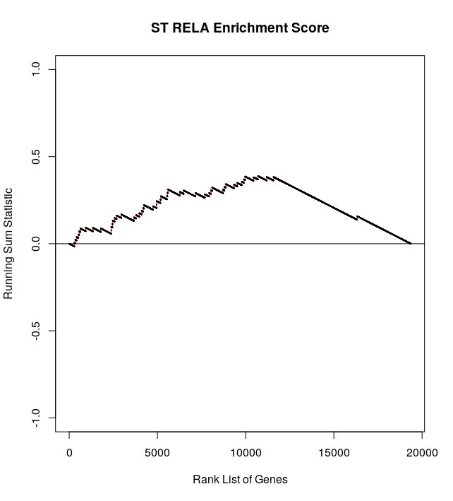

EPNClassifier
================

EPNClassifier is able to assign ependymal tumors profiled by transcriptomic techniques into distinct subgroups. This method is based on gene set enrichment analysis and utilizes pre-determined gene signatures to calculate a running sum statistic and p-value. Significant p-values can be used to classify EPN tumors into their most-likely molecular subgroup and PFA tumors can be further classified into subtypes (PFA_1 and PFA_2). 

Installation
-----------------

```{r}
devtools::install_github("CamaraLab/EPNClassifier")
library(EPNClassifier)
```

Tutorial
-----------------

Example data for 209 EPN tumors profiled by DNA microarrays is from [Pajtler K.W. et al., Cancer Cell (2015)](https://www.sciencedirect.com/science/article/pii/S153561081500135X?via%3Dihub) and can be
downloaded [here](https://www.dropbox.com/s/jc87se1hi00w0i3/Normalized_Microarray.txt?dl=1)

### Classify EPN into their molecular subgroups

Calculate the overall running sum statistics and p-vlaues for each EPN tumor.

```{r}
classification <- ClassifyEPN(bulk = data, permutations = 10000)

#Assign each sample to a single molecular subgroup
molec_gps <- Classify(classification, min_pvalue = 0.35)
```

Plot the running sum statistic (ie. enrichment score ES) over a ranked list of genes for a specific EPN sample.

```{r}
ES <- EnrichmentScore_EPN(bulk_sample = data[,1,drop=F])

plot(x = ES$ST_EPN_RELA$x, y = ES$ST_EPN_RELA$y, xlab = "Rank List of Genes", ylab = "Running Sum Statistic", 
  main = "ST RELA Enrichment Score", cex=.1, ylim = c(-1,1) , panel.first = c(lines(x = ES$ST_EPN_RELA$x, 
  y = ES$ST_EPN_RELA$y, col = "red"),abline(h = 0)))
```




### Classify PF_A tumors into their subtypes (PFA_1 and PFA_2)

Calculate the overall running sum statistics and p-vlaues for each PF_A tumor.

```{r}
#Restrict to PFA tumors
pfa_data <- data[,names(molec_gps)[molec_gps %in% "PF_EPN_A"]]

classification_pf <- ClassifyPFA(bulk = pfa_data, permutations = 10000)

#Assign each sample to a single PFA subtype
pf_gps <- Classify(classification, min_pvalue = 0.35)
```

Plot the running sum statistic (ie. enrichment score ES) over a ranked list of genes for a specific PF_A sample.

```{r}
ES <- EnrichmentScore_PFA(bulk_sample = pfa_data[,1,drop=F])
plot(x = ES$PFA_1$x, y = ES$PFA_1$y, xlab = "Rank List of Genes", ylab = "Running Sum Statistic", 
  main = "PFA_1 Enrichment Score", cex=.1, ylim = c(-1,1) , panel.first = c(lines(x = ES$PFA_1$x, 
  y = ES$PFA_1$y, col = "red"),abline(h = 0)))
```


